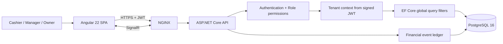
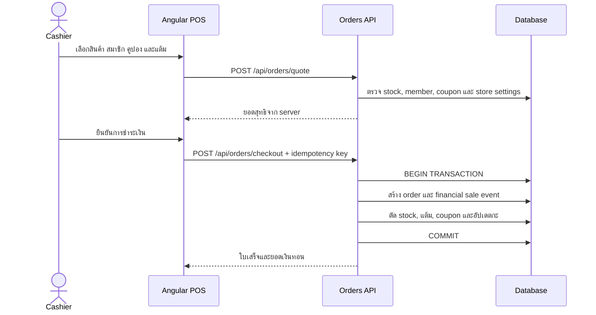
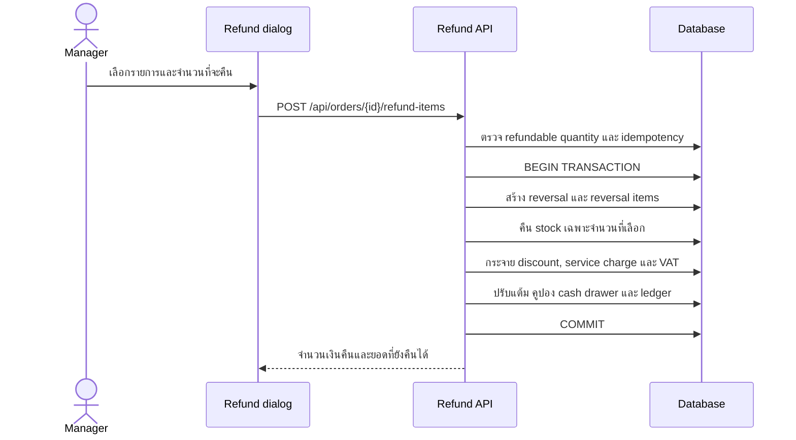
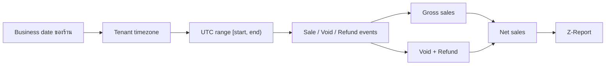
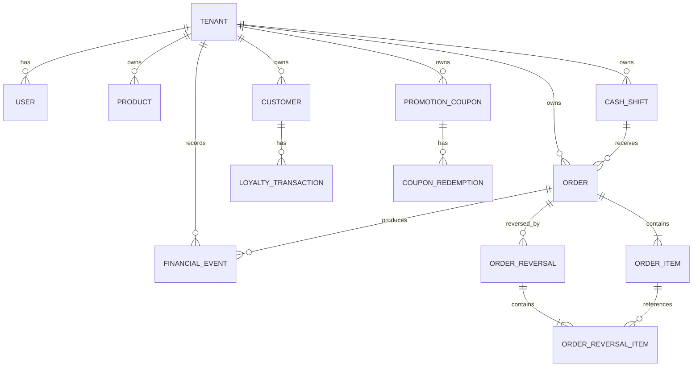

# Smart POS

ระบบ Point of Sale แบบ Multi-Tenant สำหรับร้านค้า คาเฟ่ และร้านอาหาร รองรับงานขายหน้าร้าน สต็อกสินค้า กะเงินสด สมาชิก แต้มสะสม คูปอง และการคืนเงิน โดยแยกข้อมูลของแต่ละร้านด้วย `TenantId` จาก JWT และ EF Core global query filters

## ความสามารถหลัก

- POS สำหรับเงินสด, PromptPay และบัตรเครดิต
- เปิด/ปิดกะ บันทึกเงินเริ่มต้น ยอดขาย ยอดคืนเงิน เงินคาดหวัง และส่วนต่าง
- ยกเลิกออเดอร์ คืนเงินเต็มออเดอร์ หรือคืนบางรายการ พร้อมคืนสต็อกตามจำนวน
- สมาชิก ค้นหาด้วยเบอร์โทร สะสมแต้ม แลกแต้ม และย้อนแต้มเมื่อคืนเงิน
- คูปองเปอร์เซ็นต์หรือจำนวนเงินบาท พร้อมยอดขั้นต่ำ เพดาน ช่วงเวลา และ usage limit
- Z-Report ตาม business date และ timezone ของร้าน
- Immutable financial event ledger สำหรับยอดขาย, void และ refund
- สิทธิ์ Owner, Manager และ Cashier
- Audit log และ SignalR สำหรับอัปเดตข้อมูลแบบ realtime

## Technology stack

| Layer | Technology |
|---|---|
| Frontend | Angular 22, TypeScript 6, SCSS, Signals, Vitest |
| Backend | ASP.NET Core / .NET 10, C# |
| Data access | Entity Framework Core 10 |
| Production database | PostgreSQL 16 |
| Local database | SQLite |
| Realtime | SignalR |
| Runtime | Docker Compose, NGINX |

## Architecture



ทุก entity เชิงธุรกิจมี `TenantId` และ query filter แบบ fail-closed หาก request ไม่มี tenant ที่เชื่อถือได้ API จะไม่คืนข้อมูลร้านใดเลย Header จาก client ไม่สามารถเปลี่ยน tenant ที่อยู่ใน signed JWT ได้

## Checkout transaction



Backend เป็น pricing source of truth การคำนวณส่วนลด service charge, VAT, แต้ม และยอดรวมจะถูกตรวจซ้ำก่อนบันทึกเสมอ

## Partial refund transaction



กติกาสำคัญ:

- คืนได้ไม่เกินจำนวนที่ขายลบจำนวนที่เคยคืนแล้ว
- full refund ใช้ `/api/orders/{id}/refund` ส่วน partial refund ใช้ `/api/orders/{id}/refund-items`
- coupon usage จะคืนเมื่อออเดอร์ถูกคืนครบทั้งหมด
- การปัดเศษใช้ยอดสะสม เพื่อให้การคืนหลายครั้งรวมกันไม่เกินยอดออเดอร์แม้แต่หนึ่งสตางค์
- เงินสดที่คืนจะหักจากกะเงินสดที่เปิดอยู่
- replay ด้วย idempotency key และ payload เดิมจะได้ผลเดิม ส่วน key เดิมกับ payload อื่นจะถูกปฏิเสธ

## Business timezone และ Z-Report



Timestamp ถูกเก็บเป็น UTC แต่ขอบเขตรายวันคำนวณจาก timezone ของร้าน เช่น `Asia/Bangkok` การ refund วันถัดไปจึงไม่ทำให้ยอดขายวันเดิมหาย และจะแสดงเป็นรายการลดในวันที่เกิด refund

## Data model



## เริ่มใช้งานแบบ Local

สิ่งที่ต้องมี:

- .NET SDK 10
- Node.js 22+
- npm 11+

เปิด API:

```powershell
dotnet restore backend/SmartPos.slnx
dotnet run --project backend/SmartPos.Api --launch-profile http
```

เปิด frontend ในอีก terminal:

```powershell
Set-Location frontend
npm ci
npm start
```

จากนั้นเปิด:

- Web: <http://localhost:4200>
- API: <http://localhost:5002>
- Swagger ใน Development: <http://localhost:5002/swagger>

Local development ใช้ SQLite และจะสร้าง/อัปเกรด `backend/SmartPos.Api/smart_pos.db` อัตโนมัติ

### Demo accounts

| Role | Email | Password |
|---|---|---|
| Owner | `owner@coffee.com` | `password123` |
| Cashier | `cashier@coffee.com` | `password123` |

ข้อมูลตัวอย่างมีสมาชิกเบอร์ `0812345678` และคูปอง `WELCOME10`, `SAVE50`

## เริ่มใช้งานด้วย Docker

สร้างไฟล์ environment:

```powershell
Copy-Item .env.example .env
```

เปลี่ยน `POSTGRES_PASSWORD` และ `JWT_SIGNING_KEY` ใน `.env` ก่อนเริ่มระบบ แล้วรัน:

```powershell
docker compose up --build -d
docker compose ps
```

- Web: <http://localhost:8082>
- API: <http://localhost:5002>
- PostgreSQL สำหรับ local tooling: `127.0.0.1:5435`

ไฟล์ `docker-compose.override.yml` เปิด PostgreSQL port เฉพาะ local development สำหรับ production ให้ใช้ base file โดยไม่ publish database:

```powershell
docker compose -f docker-compose.yml --env-file .env up --build -d
```

Production Compose ใช้ `ASPNETCORE_ENVIRONMENT=Production`, บังคับรับ secrets จาก environment, ไม่มี fixed container names และจำกัดขนาด container logs

## API overview

| Area | Endpoints |
|---|---|
| Authentication | `/api/auth/register-store`, `/api/auth/login`, `/api/auth/me` |
| Orders | `/api/orders`, `/api/orders/quote`, `/api/orders/checkout` |
| Refunds | `/api/orders/{id}/void`, `/api/orders/{id}/refund`, `/api/orders/{id}/refund-items` |
| Cash shifts | `/api/cash-shifts/current`, `/api/cash-shifts/open`, `/api/cash-shifts/{id}/close` |
| Members | `/api/customers`, `/api/customers/search`, `/api/customers/{id}/points` |
| Promotions | `/api/promotions`, `/api/promotions/validate` |
| Reports | `/api/reports/summary`, `/api/reports/audit-logs` |
| Settings | `/api/storesettings` |

## การทดสอบ

```powershell
dotnet build backend/SmartPos.slnx
dotnet test backend/SmartPos.slnx

Set-Location frontend
npm run build
npm test -- --watch=false
npm audit --omit=dev
```

ตรวจ Docker configuration:

```powershell
docker compose --env-file .env.example config --quiet
docker compose -f docker-compose.yml --env-file .env.example config --quiet
```

PostgreSQL integration test เป็นชุด opt-in ที่ต้องใช้ Docker daemon โดยตรวจ migration จริง, tenant filters และ optimistic concurrency บน PostgreSQL ส่วน business-rule tests ครอบคลุม stock, coupon, points, shift และ partial refund ในชุดทดสอบปกติ

รันชุด PostgreSQL migration, tenant-filter และ optimistic-concurrency smoke test:

```powershell
$env:RUN_POSTGRES_INTEGRATION_TESTS = "true"
dotnet test backend/SmartPos.slnx --filter "Category=PostgreSqlIntegration"
```

## Project structure

```text
smart-pos-system/
├─ backend/
│  ├─ SmartPos.Api/
│  │  ├─ Controllers/
│  │  ├─ Data/
│  │  ├─ Dtos/
│  │  ├─ Infrastructure/
│  │  ├─ Models/
│  │  └─ Services/
│  └─ SmartPos.Api.Tests/
├─ frontend/
│  ├─ src/app/
│  ├─ Dockerfile
│  └─ nginx.conf
├─ docker-compose.yml
├─ docker-compose.override.yml
└─ .env.example
```

## Production checklist

- ใช้ JWT signing key และ database password ที่สร้างจาก secret manager
- terminate HTTPS ที่ load balancer/reverse proxy
- จำกัด CORS ให้เฉพาะ production origin
- สำรอง PostgreSQL และทดสอบ restore
- รัน PostgreSQL integration/concurrency tests ก่อน deploy
- ตรวจ migration และ business timezone ของแต่ละ tenant
- ติดตาม audit log, failed authentication, refund และ cash variance
- ห้ามใช้ demo accounts/passwords ใน production
